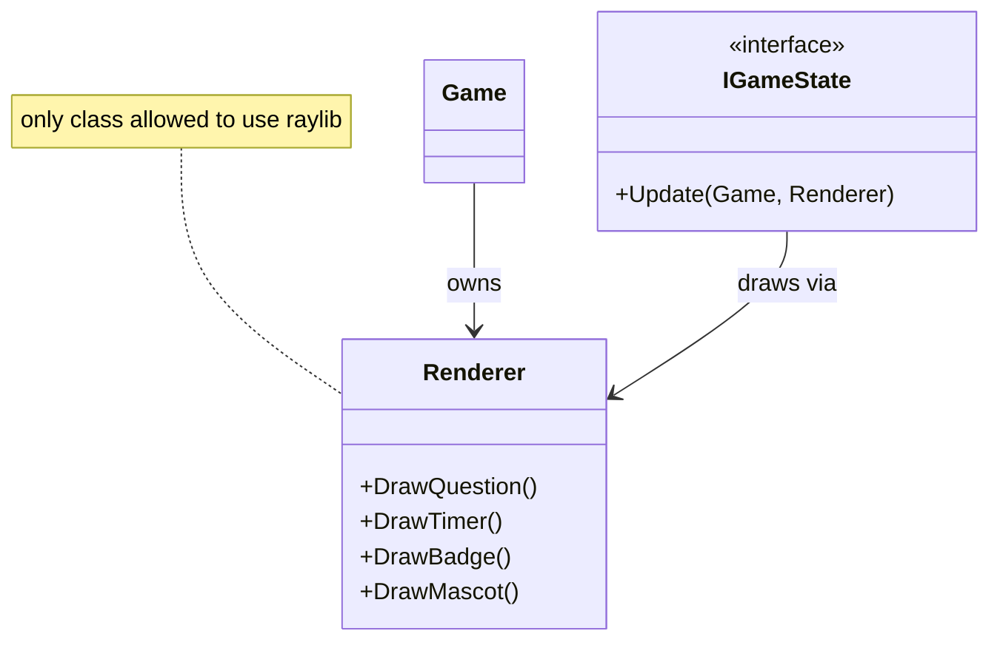
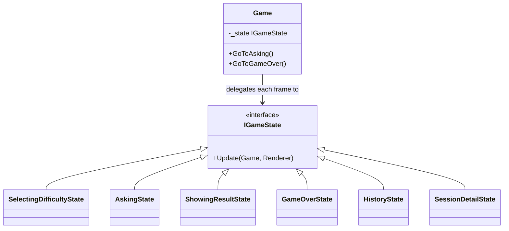
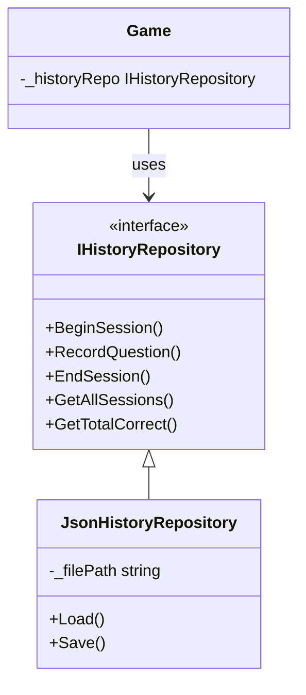

# Noonoo

Mental calculation training app written in C++ with [raylib](https://www.raylib.com/).

## Compilation

**Requirements:** CMake 3.14+, a C++17 compiler, and the following system packages (Linux):

```bash
sudo apt install libgl1-mesa-dev libx11-dev libxrandr-dev libxinerama-dev libxcursor-dev libxi-dev
```

raylib is fetched automatically via CMake FetchContent — no manual installation needed.

```bash
# Configure (first time, or after CMakeLists.txt changes)
cmake -B build -DCMAKE_BUILD_TYPE=Release

# Build
cmake --build build
```

## Running

```bash
./build/noonoo
```

## Features

### Core gameplay
Questions are generated randomly (+, −, ×, ÷) and three answer choices are presented. The player clicks the correct answer and gets immediate feedback.

### Difficulty levels
Three levels selectable at the start of each game:
- **Easy** — additions and subtractions, values 1–10, 90 seconds
- **Medium** — adds multiplication, values 1–20, 60 seconds
- **Hard** — adds division, values 1–50, 45 seconds

### Timed quiz
Each game is a timed session. A colour-coded progress bar (green → yellow → red) shows the remaining time. The game ends automatically when the timer reaches zero.

### History & serialisation
Every completed game is saved to `history.json` alongside the full list of questions, the player's answers, and whether each was correct. The history screen lets you browse past sessions and drill into a scrollable detail view for each one.

> **Tip:** deleting `history.json` resets all XP and returns the player to level 1.

### Mascot
An animated ninja sprite wanders freely across the screen. It can be shown or hidden at any time via the **Mascot ON / Mascot OFF** toggle button (bottom-right corner).

### Gamification — level system
A persistent level (1 to 4) is computed from the total number of correct answers across all sessions. Each level unlocks a new ninja skin and a new badge shape displayed in the top-left corner:

| Level | Threshold | Ninja       | Badge     |
|-------|-----------|-------------|-----------|
| 1     | 0         | NinjaGreen  | Circle    |
| 2     | 10        | NinjaBlue   | Triangle  |
| 3     | 25        | NinjaRed    | Diamond   |
| 4     | 50        | NinjaYellow | Pentagon  |

A progress bar under the badge shows how many correct answers remain until the next level. A **Level Up!** message appears on the game-over screen when a new level is reached.

## Code structure

```
include/                   — all headers
│
├── Game.hpp               — main game loop and state orchestrator
├── Renderer.hpp           — all raylib/raygui calls (only class allowed to use them)
├── Question.hpp           — question data model (lvalue op rvalue = result)
├── QuestionFactory.hpp    — generates random questions based on difficulty
├── QuestionSign.hpp       — arithmetic operator enum (+, −, ×, ÷)
├── QuestionRecord.hpp     — record of a single played question
├── GameSession.hpp        — a completed game session (score, questions)
├── Difficulty.hpp         — difficulty enum
├── Mascot.hpp             — mascot logic (position, animation, visibility)
├── PlayerLevel.hpp        — level computation and badge/ninja configuration
├── IGameState.hpp         — State pattern interface
├── IHistoryRepository.hpp — Repository pattern interface for history storage
├── JsonHistoryRepository.hpp — JSON file implementation of IHistoryRepository
│
└── states/
    ├── SelectingDifficultyState.hpp
    ├── AskingState.hpp
    ├── ShowingResultState.hpp
    ├── GameOverState.hpp
    ├── HistoryState.hpp
    └── SessionDetailState.hpp

src/                       — all implementations (mirrors include/)
assets/
├── fonts/                 — Helvetica-Bold.ttf
└── sprites/               — ninja sprite sheets (Walk.png per ninja type)
```

### Key design decisions

**Renderer isolation** — `Game`, `Question`, and all states are raylib-free. Every draw call goes through `Renderer`. This makes it straightforward to swap the graphics backend without touching business logic.



**State pattern** — each screen (difficulty selection, question, result, game over, history) is an `IGameState` subclass. `Game` holds a single `std::unique_ptr<IGameState>` and delegates each frame to it, keeping the game loop minimal.



**Repository pattern** — `IHistoryRepository` abstracts history persistence. `JsonHistoryRepository` is the concrete implementation; a different storage backend (database, cloud, etc.) can be swapped without touching `Game` or the states.


